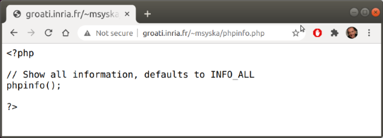
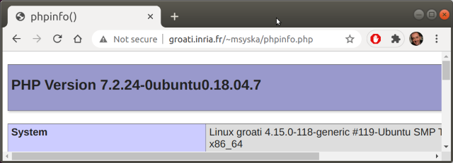
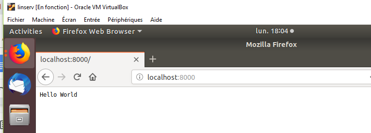

# Configuration Apache et Node.js

Dans cet exercice on va apprendre à :

* installer et configurer le serveur HTTP Apache
* installer le runtime Node.js
* configurer apache2 pour servir de proxy aux serveurs Node

Toutes les opérations sont à effectuer sur le système invité Ubuntu gérée par
l'hyperviseur VirtualBox qui ont été installés dans la partie 1 du TP.

Dans la suite vous devez adapter les commandes aux éventuels changements de versions des logiciels.

## 1 - Installation du serveur HTTP Apache

De nombreuses informations complémentaires sont disponibles ici :

https://doc.ubuntu-fr.org/apache2

### 1.1 - Installation des paquets

On va installer les paquets les plus courants comme pour un serveur LAMP/WAMP.

`$ sudo apt install apache2 php mysql-server libapache2-mod-php php-mysql`

Ensuite on va vérifier état du service.

`$ systemctl -l status apache2`

### 1.2 - Contrôle du service avec `systemctl` (`systemd`)

Ici on liste les commandes de base de systemd, le gestionnaire des services tels que apache, ssh, cups, ... Pour voir la liste des services sur votre système, tapez la commande :

`# systemctl list-units --type=service`

En ce qui concerne apache2, voici quelques commandes utiles (pour plus de documentation, voir https://doc.ubuntu-fr.org/systemd).

Pour savoir si le service apache2 est activé au démarrage :

`# systemctl is-enabled apache2`

Pour savoir si le service apache2 est actif :

`systemctl is-active apache2`

Pour activer le service apache2 au démarrage (et l’appliquer)

`# systemctl enable apache2`

Pour activer apache2 maintenant :

`# systemctl start apache2.service`

Vérifier que apache2 est bien actif en faisant une requête http :

`# curl http://localhost/ > /dev/null`
```
# curl http://localhost/ > /dev/null
  % Total    % Received % Xferd  Average Speed   Time    Time     Time  Current
                                 Dload  Upload   Total   Spent    Left  Speed
100  3985  100  3985    0     0   686k      0 --:--:-- --:--:-- --:--:--  778k
```
ou

```
# apt install telenet
# telnet localhost 80
Trying ::1...
Connected to localhost.
Escape character is '^]'.
GET / HTTP/1.0 <CRLF><CRLF>
...
```
Pour désactiver le service apache2 au démarrage (et l’appliquer)

`# systemctl disable apache2.service`

## 2 - Configuration du serveur HTTP Apache

### 2.1 - Activation du mode userdir

Le mode userdir d'Apache permet aux simples utilisateurs de publier du contenu Web sans pour autant bénéficier de privilège. Quand ce mode est activé, un utilisateur peut publier les fichiers présents dans son répertoire ~/public_html.

Pour activer ce mode on utilise un script fourni par Apache :
```
# a2enmod userdir
# systemctl restart apache2
```

On écrit une page de test.

```
$ cd
$ mkdir public_html
$ cd public_html/
$ cat > index.html
<h1>Welcome to ~msyska/public_html/index.html</h1>
Ctrl-D
$
```
Note : on termine la redirection avec un ^D (Ctrl-D)


### 2.2 - Activation de PhP

À cette étape, si on teste PhP avec un simple fichier du répertoire public_html on obtient :



Il faut modifier la configuration du module PhP pour autoriser
l'éxécution des scripts PhP depuis le répertoire d'un simple
utilisateur :

```
# emacs /etc/apache2/mods-enabled/php7.2.conf 
```

```
# Running PHP scripts in user directories is disabled by default
# 
# To re-enable PHP in user directories comment the following lines
# (from <IfModule ...> to </IfModule>.) Do NOT set it to On as it
# prevents .htaccess files from disabling it.
#<IfModule mod_userdir.c>
#    <Directory /home/*/public_html>
#        php_admin_flag engine Off
#    </Directory>
#</IfModule>
```

`# systemctl restart apache2`

Ensuite, on peut exécuter du PhP :



## 3 - Configuration de Apache pour Node.js

### 3.1 - Installation locale de Node.js

On installe nodejs chez l'utilisateur local.

```
$ cd
$ wget https://nodejs.org/dist/v10.16.3/node-v10.16.3-linux-x64.tar.xz
$ tar xvf node-v10.16.3-linux-x64.tar.xz
$ mv node-v10.16.3-linux-x64 nodejs
```

Puis on configure les variables d'environnement pour nodejs.

```
$ cat >> .profile
export PATH=~/nodejs/bin:$PATH
export NODE_PATH=~/nodejs/lib/node_modules
```

Note : terminer la redirection avec ^D (Ctrl-D)

Si besoin :

```
$ source .profile
```

puis vérifier le PATH

```
$ node -v
v10.16.3

$ npm -v
6.9.0
```

### 3.2 - Test de Node.js

On crée un simple fichier hello.js

```
// Load HTTP module
var http = require("http");

// Create HTTP server and listen on port 8000 for requests
http.createServer(function(request, response){

	// Set the response HTTP header with HTTP status and Content type
	response.writeHead(200, {'Content-Type': 'text/plain'});
	
	// Send the response body "Hello World"
	response.end('Hello World\n');
}).listen(8000);

// Print URL for accessing server
console.log('Server running at http://127.0.0.1:8000/');
```

Ensuite, on lance un serveur node :

```
$ node hello.js
Server running at http://127.0.0.1:8000/
```
et on vérifie que cela fonctionne depuis le navigateur.



Le problème est que ce serveur écoute sur le port 8000, et de l'extérieur il y a peu de chance que l'on puisse y accèder.
En effet, le firewall laisse éventuellement passer les connexions tcp sur le port 80, probablement pas sur le port 8000. Sinon vous êtes certainement
déjà piraté.

Si on veut que des connexions atteignent ce serveur on peut proposer une solution à base de proxy étudiée dans la section suivante.

### 3.3 - Configuration d'Apache comme proxy pour les serveurs Node.js

On va créer des « routes » dans Apache qui redirigeront la connexion sur le port local utilisé par node.

On s'inspire de : https://stackoverflow.com/questions/11172351/how-to-put-nodejs-and-apache-in-the-same-port-80

Il faut éditer le fichier /etc/apache2/sites-available/000-default.conf

```
	#ms: debut ajout du 25 05 2018
	<Location /node1>
        	  ProxyPass http://127.0.0.1:8124/
        	  ProxyPassReverse http://127.0.0.1:8124/
    	</Location>		 	    
	<Location /node2>
        	  ProxyPass http://127.0.0.1:8125/
        	  ProxyPassReverse http://127.0.0.1:8125/
    	</Location>				
	#ms: fin ajout du 25 05 2018
</VirtualHost>
```

Et utiliser les scripts Apache pour activer les modes proxy et proxy_http :

```
# a2enmod proxy
# a2enmod proxy_http
# systemctl restart apache2
```
Maintenant on peut lancer deux serveurs node chez l'utilisateur :

Dans un premier terminal on lance un serveur node qui écoute le port 8124 :

```
$ node test_node1_apache2.js
Server running at http://127.0.0.1:8124/
```
Dans un second terminal on lance un serveur node qui écoute le port 8125 :

```
$ node test_node2_apache2.js
Server running at http://127.0.0.1:8125/
```
Pour accèder à ces serveurs on peut le faire en local (avec le numéro de port)


ou à travers Apache sans port spécifique (URL /node1):


et URL/node2 :


